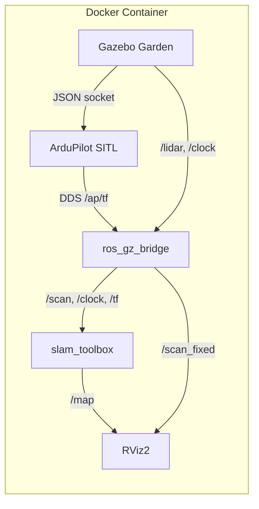

# UAV Tunnel Navigation (ROS 2 Humble + Gazebo Garden + ArduPilot SITL)

Autonomous UAV navigation through GPS-denied tunnel environments.  The drone
uses a 2-D LiDAR and SLAM to build a live occupancy map while ArduPilot
handles low-level attitude control via Software-In-The-Loop (SITL).

Everything runs inside Docker so the host system stays untouched.

## Stack

| Layer | Component | Version / Branch |
|-------|-----------|-----------------|
| Flight controller | ArduPilot SITL (ArduCopter) | master (DDS) |
| Simulator | Gazebo **Garden** (gz-sim 7) | Garden |
| ROS bridge | `ros_gz` (source build) | humble |
| ROS 2 | Humble Hawksbill | Ubuntu 22.04 |
| SLAM | `slam_toolbox` | apt (Humble) |

## Quick Start

### 1. Build the Docker image

```bash
docker build --network=host -t uav-tunnel-sim -f docker/Dockerfile .
```

> The image bakes in ArduPilot, `ros_gz` (Garden), and `ardupilot_gazebo`.
> First build takes 30-60 min; subsequent builds use layer caching.

### 2. Run the container

```bash
xhost +local:docker          # allow GUI
docker compose run --rm uav-sim
```

Or without Compose:
```bash
docker run --rm -it --net=host \
  -e DISPLAY -e QT_X11_NO_MITSHM=1 \
  -v /tmp/.X11-unix:/tmp/.X11-unix:rw \
  uav-tunnel-sim
```

### 3. Launch the simulation

Inside the container (the entrypoint auto-rebuilds project packages if
source has changed):

```bash
ros2 launch uav_tunnel_nav bringup_ardupilot.launch.py headless:=false rviz:=true
```

This starts:
- Gazebo Garden (tunnel world + iris_tunnel drone with ArduPilotPlugin)
- ArduPilot SITL (ArduCopter, DDS transport)
- `ros_gz_bridge` (clock, LiDAR scan)
- `slam_toolbox` (async SLAM)
- RViz2 (map + LiDAR overlay)

Launch arguments:

| Argument | Default | Description |
|----------|---------|-------------|
| `headless` | `true` | Set `false` to show Gazebo GUI |
| `rviz` | `true` | Show RViz2 |
| `use_slam` | `true` | Run SLAM toolbox |
| `use_sitl` | `true` | Launch ArduPilot SITL |

## WSL2 Notes

WSLg exposes X11/Wayland automatically. If you hit **out-of-memory crashes**
during Docker builds, create `C:\Users\<you>\.wslconfig`:

```ini
[wsl2]
memory=6GB
swap=4GB
```

Then restart WSL (`wsl --shutdown`).

## Project Layout

```
docker/
  Dockerfile          # Full build: ROS 2 + Gazebo Garden + ArduPilot + ros_gz
  entrypoint.sh       # Sources overlays, auto-rebuilds project packages
ros2_ws/src/
  uav_tunnel_gz/      # Gazebo world (tunnel.sdf) and drone model (iris_tunnel)
  uav_tunnel_nav/     # ROS 2 nodes, launch files, configs
dashboard/            # Optional live trajectory + sensor GUI
compose.yaml          # Docker Compose service definition
```

## Architecture



## Key Topics

| Topic | Type | Source |
|-------|------|--------|
| `/scan` | `sensor_msgs/LaserScan` | ros_gz_bridge (from Gazebo LiDAR) |
| `/scan_fixed` | `sensor_msgs/LaserScan` | `scan_reframe` node (frame_id -> base_link) |
| `/clock` | `rosgraph_msgs/Clock` | ros_gz_bridge |
| `/ap/tf` | `tf2_msgs/TFMessage` | ArduPilot DDS |
| `/tf` | `tf2_msgs/TFMessage` | relay from `/ap/tf` |
| `/map` | `nav_msgs/OccupancyGrid` | slam_toolbox |

## Legacy Launch Files

The older simulation modes are still available:

```bash
# Fortress + cmd_vel direct control
ros2 launch uav_tunnel_nav bringup.launch.py headless:=false

# Fortress + Aerostack2 quadrotor model
ros2 launch uav_tunnel_nav bringup_as2.launch.py headless:=false rviz:=true
```

## GUI Dashboard

```bash
python3 /dashboard/uav_dashboard.py --use-sim-time
```

## Development Workflow

The `compose.yaml` bind-mounts only `uav_tunnel_gz/` and `uav_tunnel_nav/`
source directories. Edit files on the host; the entrypoint detects changes and
runs an incremental `colcon build` on container start.  To manually rebuild:

```bash
cd /ros2_ws
colcon build --packages-select uav_tunnel_gz uav_tunnel_nav
source install/setup.bash
```
